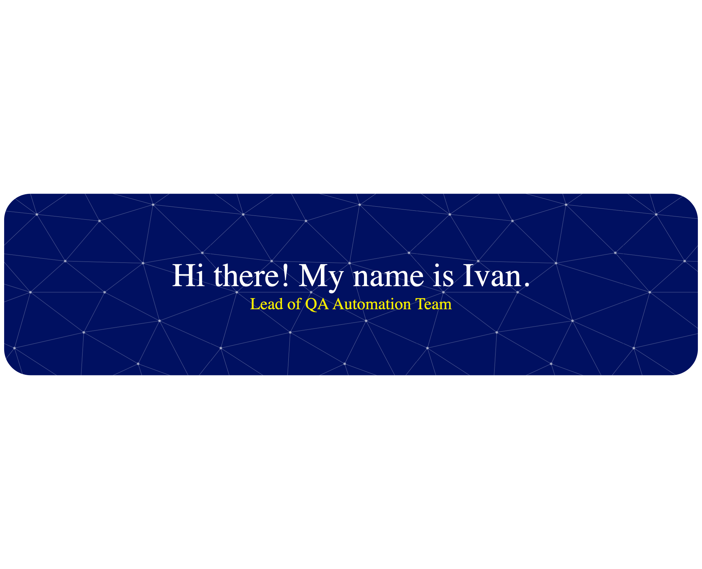

### QA Engineer → Java Developer | Banking & Fintech | AI-энтузиаст

> *"Качество — это не этап, это образ мышления."*

Я начинал с обеспечения качества, а теперь пишу код, который этому качеству соответствует.
Специализируюсь на **Java-разработке** в **банковской сфере**, автоматизации тестирования
и интеграции **AI-инструментов** в процесс разработки.

---

## 🛠️ Технологический стек

---

## 🚀 Что я делаю

- 🏦 **Banking & Fintech** — разрабатываю и тестирую банковские продукты, работаю с шаблонами и API крупных финансовых систем.
- 🧪 **QA + Automation** — BDD-подход, автотесты API, обеспечение качества на всех этапах SDLC.
- 🤖 **AI в разработке** — создаю AI-агентов, которые ускоряют написание и ревью кода.
- 📚 **Постоянное развитие** — от pet-проектов до production-решений.

---

## 📌 Избранные проекты

| Проект | Описание | Стек |
|--------|----------|------|
| [**CodeBoosterUtility**](https://github.com/ITmeansIvanTyulkin/CodeBoosterUtility) | 🤖 AI-агент для ускорения разработки и улучшения качества кода | AI, Java |
| [**BankingProducts**](https://github.com/ITmeansIvanTyulkin/BankingProducts) | 🏦 Разработка банковских продуктов | Java |
| [**API_BDD**](https://github.com/ITmeansIvanTyulkin/API_BDD) | 🧪 BDD-тестирование API | Java, BDD |
| [**SBER_templates**](https://github.com/ITmeansIvanTyulkin/SBER_templates) | 📋 Шаблоны для банковских решений | Java |

👉 [**Все репозитории →**](https://github.com/ITmeansIvanTyulkin?tab=repositories)

---

## 📊 Немного цифр

- 💻 **34** публичных репозитория
- 📈 **107+** контрибуций за последний год
- ⭐ Растущая коллекция pet-проектов и AI-инструментов

---

## 📫 Связаться со мной

Открыт к предложениям в **Java-разработке**, **QA Automation**
и **AI-driven development**. Пишите — отвечу быстро. ⚡

---

  <i>«Хороший код — это код, который не стыдно показать. Отличный код — это код, который не стыдно показать через год.»</i>

